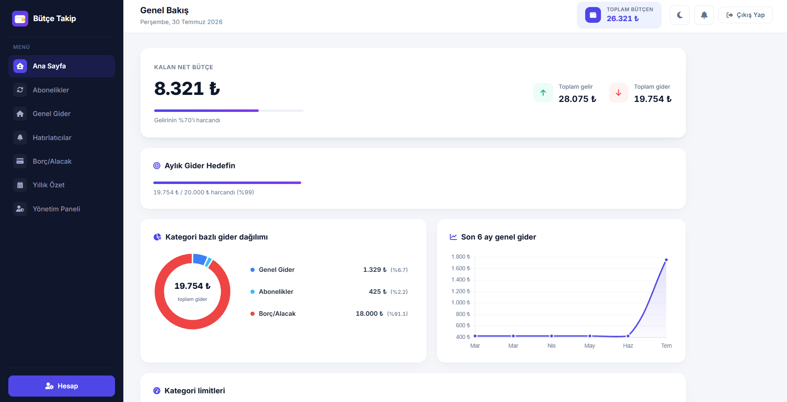
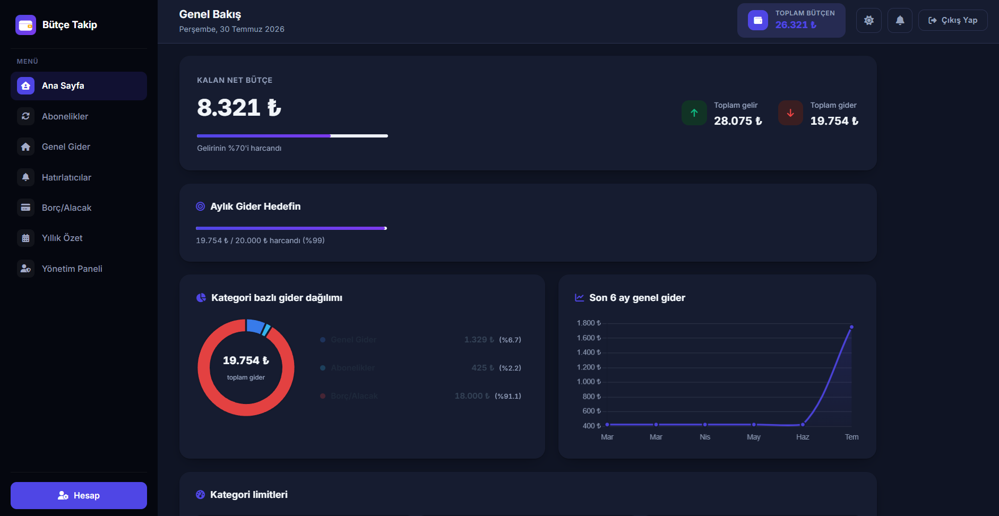
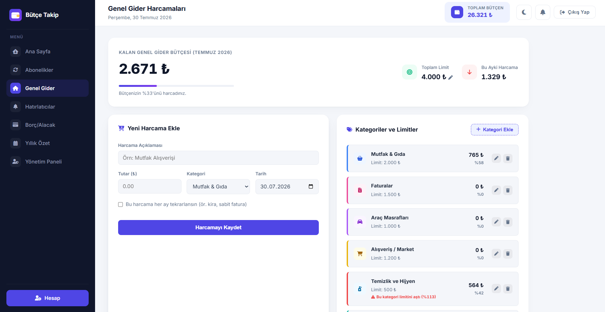
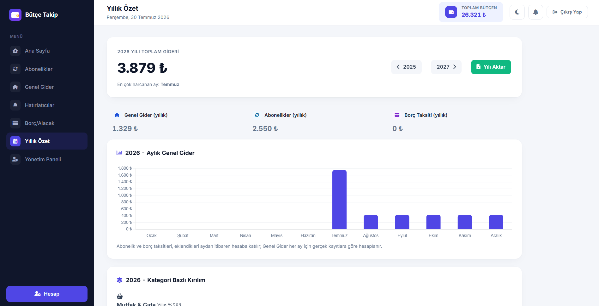

# Bütçe Takip Sistemi


Gelir, gider, abonelik, hatırlatıcı ve borç/alacaklarını tek bir yerden takip edebileceğin, PHP ve MySQL ile geliştirilmiş kişisel bütçe yönetim sistemi.

---

## Ekran Görüntüleri

| Genel Bakış | Karanlık Mod |
|---|---|
|  |  |

| Genel Gider | Yönetim Paneli |
|---|---|
|  |  |

---

## Özellikler

### Genel
- **Genel Bakış (Dashboard):** Aylık gelir/gider özeti, kategori bazlı gider dağılım grafiği, son 6 aylık genel gider trendi
- **Genel Gider (Ev/Market) Takibi:** Kategorilere göre harcama girişi, kategori bazlı limit belirleme, tekrarlayan (otomatik yenilenen) harcamalar
- **Kategori Bazlı Bütçe Önerisi:** Son 3 ayın ortalamasına göre otomatik limit önerisi
- **Abonelik Takibi:** Aylık/yıllık abonelikler, otomatik yenilenen ödeme tarihleri, iptal/tekrar aktif etme
- **Hatırlatıcılar:** Takvim görünümlü hatırlatıcı sistemi, güne tıklayarak filtreleme
- **Borç/Alacak Takibi:** Borç ve alacakların ayrı ayrı takibi, taksit ve vade yönetimi
- **Yıllık Özet:** 12 aylık gider grafiği, kategori bazlı yıllık kırılım, Excel'e (CSV) aktarma
- **Aylık Gider Hedefi:** Kendi belirlediğin bütçe hedefine göre ilerleme takibi

### Güvenlik
- Şifreler `password_hash` ile güvenli şekilde saklanır
- CSRF koruması (tüm formlarda token doğrulama)
- Bot koruması (honeypot yöntemi)
- Giriş denemesi sınırlaması (brute-force koruması)
- Oturum güvenliği (`httponly`, `samesite` çerezler, session fixation koruması)
- "Beni Hatırla" ile güvenli otomatik giriş
- E-posta ile şifre sıfırlama
- Hesap sayfasından isteğe bağlı e-posta doğrulama

### Kullanıcı Deneyimi
- Tamamen responsive tasarım (mobil uyumlu, açılır/kapanır menü)
- Karanlık / aydınlık mod
- PWA desteği (tarayıcıdan "Yükle" ile masaüstüne/ana ekrana eklenebilir)
- E-posta bildirimleri (yaklaşan hatırlatıcılar için)

### Admin Paneli
- Kullanıcı listesi, arama ve filtreleme
- Kullanıcı rolü yönetimi (kullanıcı/admin)
- Kullanıcı silme
- İşlem geçmişi (admin aktivite logu)

---

## Kullanılan Teknolojiler

* **Backend:** 
* **Veritabanı:** 
* **Frontend:** , , 
* **Arayüz İkonları:** Font Awesome

---

## Kurulum

1. Bu depoyu klonla veya indir:
   ```bash
   git clone https://github.com/Ahmetcnylmz/butcetakip.git
   ```
2. Dosyaları XAMPP/WAMP gibi bir sunucunun `htdocs` klasörüne kopyala.
3. phpMyAdmin'den boş bir `butcetakip` adında veritabanı oluştur (tablo eklemene gerek yok, otomatik kurulur).
4. `config.php` dosyasındaki veritabanı bilgilerini kendi ortamına göre düzenle:
   ```php
   $sunucu     = "localhost";
   $kullanici  = "root";
   $sifre      = "";
   $veritabani = "butcetakip";
   ```
5. Tarayıcıdan `kayit-ol.php` sayfasını aç — tüm tablolar ilk açılışta otomatik oluşturulur.

> `sql/butcetakip.sql` dosyasını da phpMyAdmin üzerinden elle içe aktarabilirsin (isteğe bağlı, otomatik kurulum zaten yeterli).
